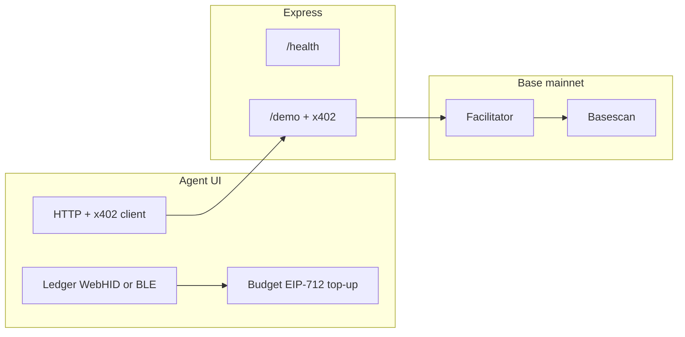

# x402 · Ledger agent POC

A small hackathon demo: a **browser-based agent** tops up a **session budget** with a **Ledger** signature, pays a **Base mainnet** API using the [**x402**](https://docs.cdp.coinbase.com/x402/docs/http-402) protocol (HTTP `402 Payment Required` → payment header → `200 OK`), and inspects **on-chain settlement** on **Basescan**.

---

## What’s inside

| Piece | Role |
|--------|------|
| **`apps/server`** | Express API: `GET /health` (free), `GET /demo` (x402 paywall at **$0.001 USDC** per call). Uses `@x402/express` and a **facilitator** for verify/settle. |
| **`apps/web`** | Vite + React **Agent UI**: balance, Ledger connect (**USB / Bluetooth**), HTTP lab (raw preview + Send), x402-paid `fetch`, settlement tx link. |
| **`packages/shared`** | Shared constants: **Base** (`eip155:8453`), native **USDC**, micropayment amounts, Basescan URL helpers. |



---

## Prerequisites

- **Node.js** v20+ and **pnpm** v9 — versions are pinned for [**proto**](https://moonrepo.dev/proto) in [`.prototools`](.prototools) (currently **Node 20.18.1** and **pnpm 9.15.9**, aligned with `packageManager` in root `package.json`).
- **Without proto:** install Node yourself, then either [pnpm’s installer](https://pnpm.io/installation) or [Corepack](https://nodejs.org/api/corepack.html) (`corepack enable` respects `packageManager`).
- **Chromium browser** (Chrome or Edge) — Ledger **WebHID** and **Web Bluetooth** work best there
- **Ledger** with the **Ethereum** app installed and up to date
- A **Base mainnet** wallet that can pay x402: **ETH for gas** and **native USDC** on Base (the facilitator settles micropayments on-chain)
- A **payout address** you control for `PAY_TO_ADDRESS` (receives USDC from buyers of your demo API)

---

## Quick start

### 1. Clone and install

**If you use [proto](https://moonrepo.dev/proto)** (recommended if your team already uses moonrepo shims):

```bash
cd x402-poc
proto install    # installs Node + pnpm versions from .prototools into ~/.proto
pnpm install
```

**Otherwise** (Corepack / system Node):

```bash
cd x402-poc
corepack enable   # optional: activates pnpm version from package.json
pnpm install
```

The `@x402-poc/shared` package builds automatically on install (`prepare` script). If imports fail, run:

```bash
pnpm -F @x402-poc/shared build
```

### 2. Configure the server

```bash
cp apps/server/.env.example apps/server/.env
```

Edit **`apps/server/.env`**:

| Variable | Description |
|----------|-------------|
| **`PAY_TO_ADDRESS`** | **Required.** Your EVM address on Base that receives USDC from paid `/demo` calls. |
| **`FACILITATOR_URL`** | Default `https://x402.dexter.cash` (supports **Base mainnet** `exact` in `/supported`). Use another URL only if it advertises your `network` + scheme; `https://x402.org/facilitator` may not list `eip155:8453`. |
| **`CORS_ORIGIN`** | Default `http://localhost:5173`. Add more origins comma-separated if needed. |
| **`PORT`** | Default `4020`. |

### 3. Configure the web app (optional)

```bash
cp apps/web/.env.example apps/web/.env
```

| Variable | Description |
|----------|-------------|
| **`VITE_DEFAULT_API_BASE`** | API origin the UI calls. Default `http://localhost:4020`. |
| **`VITE_BASE_RPC`** | JSON-RPC for Base. Default `https://mainnet.base.org` (use your own RPC for demos if you hit rate limits). |

### 4. Run everything (development)

From the **repository root**:

```bash
pnpm dev
```

This will:

1. Build **`@x402-poc/shared`**
2. Start the **API** on `http://localhost:4020` (or your `PORT`)
3. Start the **UI** on `http://localhost:5173`

**Run separately** (after shared is built once):

```bash
pnpm dev:server   # API only
pnpm dev:web      # UI only
```

### 5. Production-style build

```bash
pnpm build
```

- Server output: `apps/server/dist` — run with `pnpm -F @x402-poc/server start` from the repo root (ensure `apps/server/.env` is present; `dotenv` is loaded in the server entry).
- Web output: `apps/web/dist` — serve with any static host or `pnpm -F @x402-poc/web preview`.

---

## Using the Agent UI

Open **`http://localhost:5173`**.

### Connect your Ledger

1. **Choose transport**
   - **USB (WebHID)** — Ledger Nano S / S Plus / X via cable. Chrome will prompt to pair the device.
   - **Bluetooth (Web BLE)** — Typically **Nano X**; browser must support Web Bluetooth (Chrome on desktop; OS Bluetooth on).
2. Click **Connect Ledger** and approve the device connection in the browser / OS.
3. On the device, open the **Ethereum** app.

The UI shows your **derived address** (default path `44'/60'/0'/0/0`) and an **on-chain USDC balance** line (reads native USDC on Base).

### Top up the agent budget (off-chain cap)

1. Click **Top up budget (sign)**.
2. On the Ledger, review and sign the **EIP-712 “AgentBudget”** message (demo cap: **0.25 USDC**).
3. The signature and cap are stored in **browser local storage** so refresh keeps the session story.

The UI tracks **spent** vs **remaining** against that cap before sending x402-paid requests (server enforcement is still the real x402 + facilitator flow).

### Call the API

- **Blank: GET /health** — Unpaid smoke test → JSON `{ ok: true }`.
- **Blank: GET /demo (unpaid)** — See **`402 Payment Required`** and the payment challenge headers/body.
- **Paid: GET /demo (x402)** — Enables **Pay with x402**: first request may get `402`, then the client signs and retries with the payment header.

Use **View raw request** to inspect the request line, headers, and body. **Send** runs `fetch`; with x402 enabled, the wrapped client handles the payment retry.

### Settlement and explorer

Successful paid responses may include a **`PAYMENT-RESPONSE`** header. The UI records settlement **transaction hashes** and offers **View settlement on Basescan** (mainnet: `https://basescan.org/tx/...`).

**Reset session / budget** clears local budget state and the list of recorded txs (it does not revoke on-chain authorizations).

---

## API reference (demo)

| Method | Path | Payment |
|--------|------|--------|
| `GET` | `/health` | None |
| `GET` | `/demo` | **$0.001 USDC** per successful access (x402 **exact** scheme on **Base**, `eip155:8453`) |

CORS exposes `PAYMENT-REQUIRED` and `PAYMENT-RESPONSE` so the browser can read them.

---

## Troubleshooting

| Issue | What to try |
|--------|-------------|
| **WebHID not available** | Use Chrome/Edge; site must be **HTTPS** or **`localhost`**. |
| **Bluetooth pairing fails** | Prefer USB for the demo; BLE is sensitive to OS permissions and Nano X firmware. |
| **Signing fails on Ledger** | Update Ethereum app; enable **blind signing** only if your build requires it for large EIP-712 payloads. |
| **402 never becomes200** | Ensure the payer has **Base ETH + USDC**; check facilitator supports **mainnet**; verify `PAY_TO_ADDRESS` is a valid checksum address. |
| **`PAY_TO_ADDRESS` error on start** | Create `apps/server/.env` from `.env.example` and set a real address. |
| **CORS errors** | Match `CORS_ORIGIN` to your UI origin (e.g. `http://localhost:5173`). |

---

## Security & scope

This repo is a **demo**: session budget logic in the UI is for UX only; **real payment validation and settlement** are handled by **x402** and your **facilitator**. Use **test wallets** and small amounts when experimenting on **mainnet**.

---

## License

Private / hackathon POC — adjust as needed for your team.
